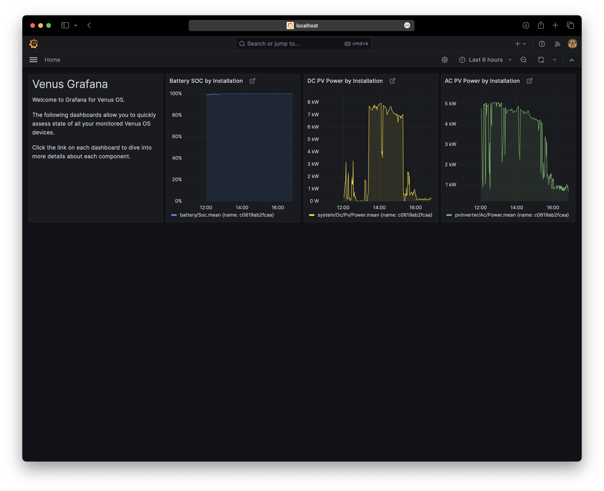
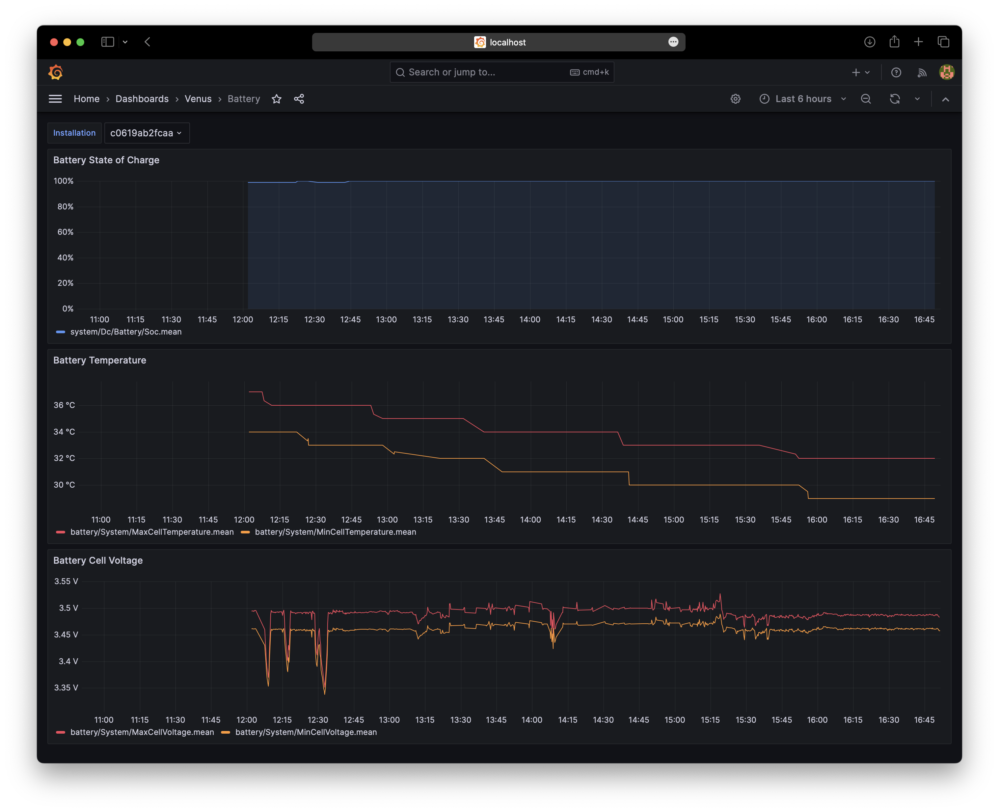
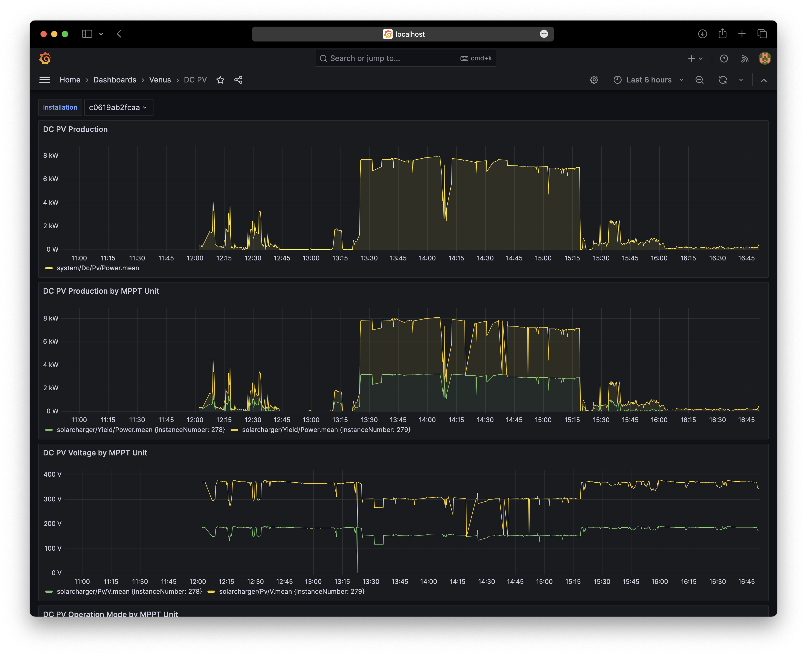

# Venus Grafana Dashboards

This repository contains preconfigured Grafana Dasboards and Grafana Datasources to be used in Grafana integration into Venus OS.

The dashboards visualize data collected from one or more Venus OS systems by Venus Influx Loader and stored into InfluxDB.

Optionally Grafana can talk directly to Venus Influx Loader via `grafana-api` endpoint and provide runtime info about live Venus OS systems that Venus Influx Loader is collecting data from.

## Overview

The following dashboards are included by default.

Welcome dashboard sumarizing battery state of charge, and DC/AC PV production. All charts are broken down by installation in case you are visualizing multiple Venus OS installations at the same time.



Battery dashboard sumarizes state of charge, min/max cell voltage, and min max cell temperature for selected Venus OS installation.



DC PV dashboard sumarizes MPPT solarcharger output power, voltate, and operation mode for selected Venus OS installation. Charts are broken down by instance in case your system contains multiple MPPT Solar Chargers.



AC PV dashboard sumarizes AC coupled output power, and power limit for selected Venus OS installation. Charts are broken down by instance in case your system contains multiple AC coupled inverters.


## Configuration

The following environment variables need to be specified to configure Grafana InfluxDB datasource used by the dashboards:

- `VIL_INFLUXDB_URL`: InfluxDB URL used by Grafana InfluxDB datasource.
  Example: `VIL_INFLUXDB_URL=http://localhost:8086`

- `VIL_INFLUXDB_USERNAME`: InfluxDB username used by Grafana InfluxDB datasource. 
  Example: `VIL_INFLUXDB_USERNAME=s3cr4t`

- `VIL_INFLUXDB_PASSWORD`: InfluxDB password used by Grafana InfluxDB datasource.
  Example: `VIL_INFLUXDB_PASSWORD=s3cr4t`


The following environment variables may be specified to configure Grafana API datasource:

- `VIL_GRAFANA_API_URL`: URL to access Grafana API endpoint of Venus Influx Loader.
  Example: `VIL_GRAFANA_API_URL=http://localhost:8088/grafana-api`


The files located under `grafana/provisioning` contain a `yaml` and `json` configuration files that can be used to provision fresh Grafana installation.

The `grafana/provisioning` directory needs to be copied over to `/etc/grafana/provisioning` directory on the system before starting up Grafana.

## Docker

Venus Grafana docker image provides an easy way to spin up a preconfigured and ready to be used grafana instance suitable for local development.

### Build Venus Grafana docker image locally

```
$ export OWNER="martin"
$ (cd docker && ./build-dev-image.sh)
```

### Run Venus Grafana docker image locally

```
$ export OWNER="martin"
$ (cd docker && ./run-dev-image.sh)
```

After that you can access the local Grafana instance via [http://localhost:3000]

## Adding New Dashboards

New Grafana Dashboards that you create via Grafana Interface will be stored in a SQLite database inside the docker container in `/var/lib/grafana`. These modifications will get lost when the container is removed and recreated.

It is strongly recommended to export the dashboards in JSON format once you are happy with them, and commit the exported JSON file into `grafana/provisioning/dashboards` structure so that it is picked up automatically on next container build.

The process of creating new dashboards looks like this:

1. Start Grafana, go to the admin UI via [http://localhost:3000].
2. Create new dashboard and panels, configure them as needed.
3. Export the dashboard in JSON file and save it to this repository under `grafana/provisioning`.
4. Open the saved panel and change `uid` near the end of the file to the same name you gave to the JSON file without extension so that you can later link to that new panel.
5. Linking to the panel is possible via relative link `/d/<uid>/<uid>` where `<uid>`. For example `/d/battery/battery` will link to the dashboard provisioned from `battery.json`.
6. Stop Grafana, Rebuild dev image, and repeat from step 1.
